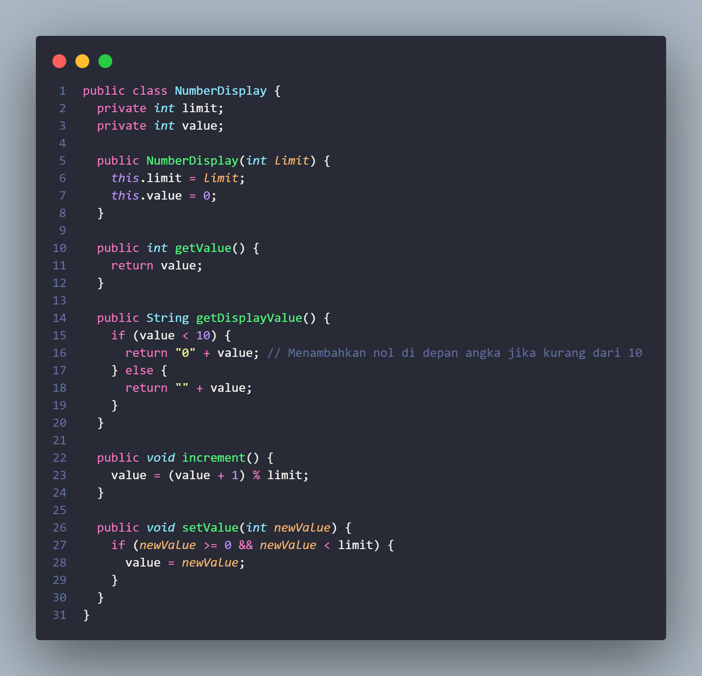
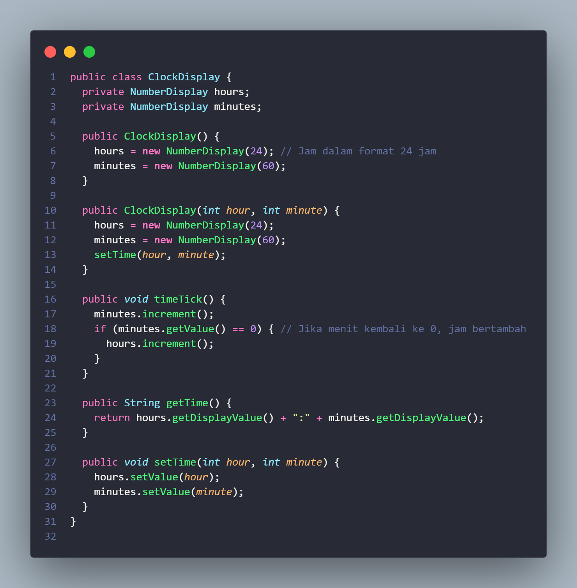

# **Studi Kasus Clock Display**

**Nama** : Adyuta Prajahita Murdianto

**NRP** : 5025221186

**Kelas** : PBO A

## **Class NumberDisplay**

### **Fungsi**

### **Method**

**1. Constructor**

**2. getValue**

**3. getDisplayValue**

**4. increment**

**5. setValue**

## **Class ClockDisplay**

### **Fungsi**

### **Method**

**1. Constructor**

**2. timeTick**

**3. getTime**

**4. setTime**

## **Class ClockMain**

### **Fungsi**

### **Method**

**1. Constructor**

**2. Main**

