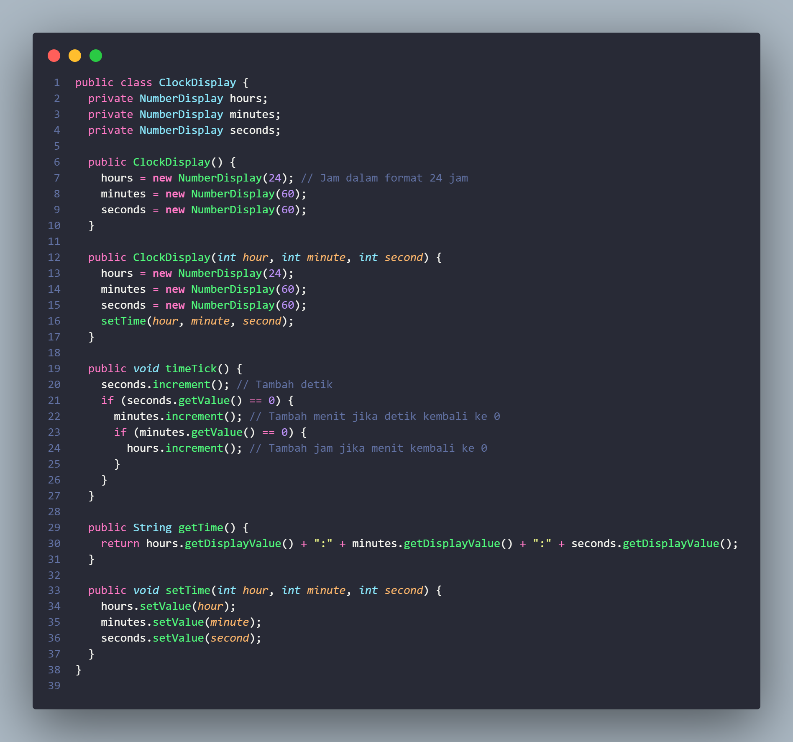
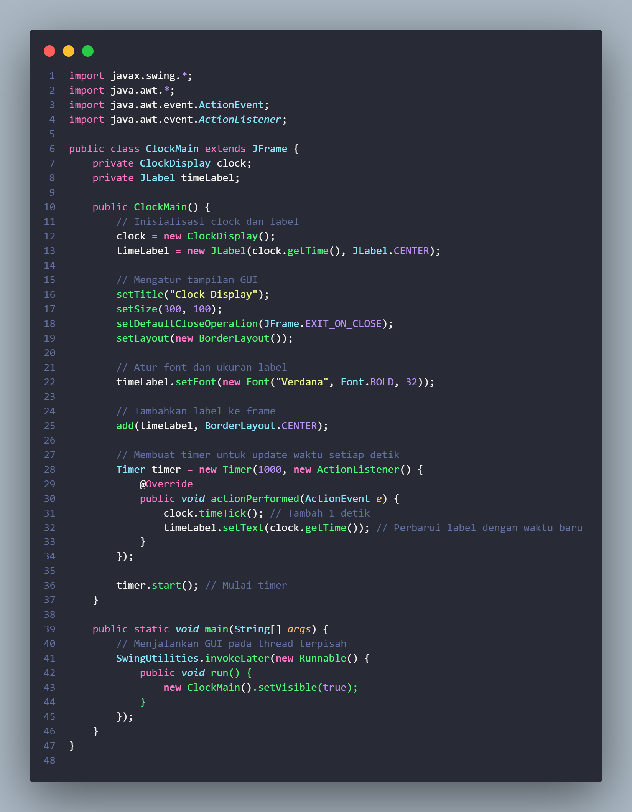

# **Studi Kasus Clock Display**

**Nama** : Adyuta Prajahita Murdianto

**NRP** : 5025221186

**Kelas** : PBO A

## **Class NumberDisplay**

### **Fungsi**

Mengelola angka-angka yang akan ditampilkan pada bagian jam, menit, dan detik. Berisi logika untuk menentukan batas maksimal angka yang ditampilkan dan set value dari angka-angka tersebut.

### **Atribut**

**1. limit**

Batas nilai maksimal angka yang ditampilkan.

**2. value**

Nilai dari angka yang ditampilkan.

### **Method**

**1. Constructor**

Berfungsi sebagai set nilai `limit` sesuai dengan input saat membuat objek dari kelas, dan set nilai default dari `value` menjadi `0`.

**2. getValue**

Berfungsi untuk mendapatkan nilai dari `value`.

**3. getDisplayValue**

Berfungsi untuk menampilkan nilai `value` dengan format dua digit.

**4. increment**

Berfungsi untuk melakukan `increment` pada nilai `value`, serta terdapat pengaturan agar nilai `value` tidak melebihi `limit` dengan cara memodulokan hasil `increment` dengan `limit`.

**5. setValue**

Berfungsi untuk mengupdate nilai dari `value` sesuai input dari `method`. Disini terdapat pengecekan agar `value` diupdate dengan nilai non-negatif dan tidak melebihi `limit`.

## **Class ClockDisplay**

### **Fungsi**

Mengelola logika utama dari jam, dimana akan menampilkan waktu saat ini, mengupdate waktu saat ini, serta juga bisa set waktu sesuai kebutuhan.

### **Atribut**

**1. hours**

Representasi jam yang menggunakan tipe data dari kelas `NumberDisplay`.  

**2. minutes**

Representasi menit yang menggunakan tipe data dari kelas `NumberDisplay`. 

**3. seconds**

Representasi detik yang menggunakan tipe data dari kelas `NumberDisplay`. 

### **Method**

**1. Constructor**

Disini terdapat dua `constructor`, pertama digunakan untuk set waktu menjadi default atau `00:00:00`, dan yang kedua memanggil method `setTime` untuk memulai program dengan waktu sesuai kebutuhan yang diinputkan kedalam parameter.

**2. timeTick**

Berfungsi untuk mengupdate waktu pada program. Pertama akan memanggil atribut `increment` pada `seconds`. Terdapat pengecekan dimana ketika `seconds` valuenya kembali ke 0 atau melewati `limit`, maka akan memanggil method `increment` pada `minutes` yang menandakan bahwa waktu sudah bertambah selama 1 menit. Lalu juga terdapat pengecekan jika nilai dari `minutes` sudah melewati batas `limit`, maka akan memanggil method `increment` pada `hours` yang menandakan waktu sudah bertambah selama 1 jam.

**3. getTime**

Berfungsi untuk menampilkan waktu dengan format `hours:minutes:seconds`.

**4. setTime**

Berfungsi untuk set waktu sesusai kebutuhan berdasarkan input pada parameter.

## **Class ClockMain**

### **Fungsi**

Berfunsi sebagai kelas utama yang akan menjalankan keseluruhan program yang akan menampilkan GUI dari program, serta akan mengupdate waktu setiap detiknya.

### **Atribut**

**1. clock**

Representasi dari pengelolaan waktu yang menggunakan tipe data dari kelas `ClockDisplay`.

**2. timeLabel**

Label yang berfungsi sebagai GUI yang akan menampilkan waktu saat ini.

### **Method**

**1. Constructor**

Berfungsi untuk menampilkan waktu serta mengupdatenya setiap detik. Pertama disini akan menginisiasi nilai `clock` dengan objek dari kelas `ClockDisplay` dan nilai `timelabel` dengan objek dari kelas `JLabel` dengan parameter pertama sebagai sesuatu yang ingin ditampilkan, dalam hal ini waktu yang didapat dengan memanggil method `getTime` dari `clock`. Lalu disini akan mengatur bagaimana layout tampilan dari waktu. Lalu disini kita membuat suatu `Timer` yang diset dengan delay satu detik, yang dimana setiap detik akan memanggil method `timeTick` dari `clock` untuk mengupdate waktu setiap detiknya. Lalu dalam `Timer` ini, kita juga akan selalu mengupdate tampilan dengan nilai waktu yang baru yang diambil dari pemanggilan method `getTime` dari `clock` yang dipanggil setelah perubahan waktu dilakukan. Lalu kita jalankan timer dengan memanggil method `start` dari `timer`

**2. Main**
 
Merupakan method utama dari program yang berfungsi untuk menjalankan program. Disini akan method akan menjalankan objek dari kelas `ClockMain`.
